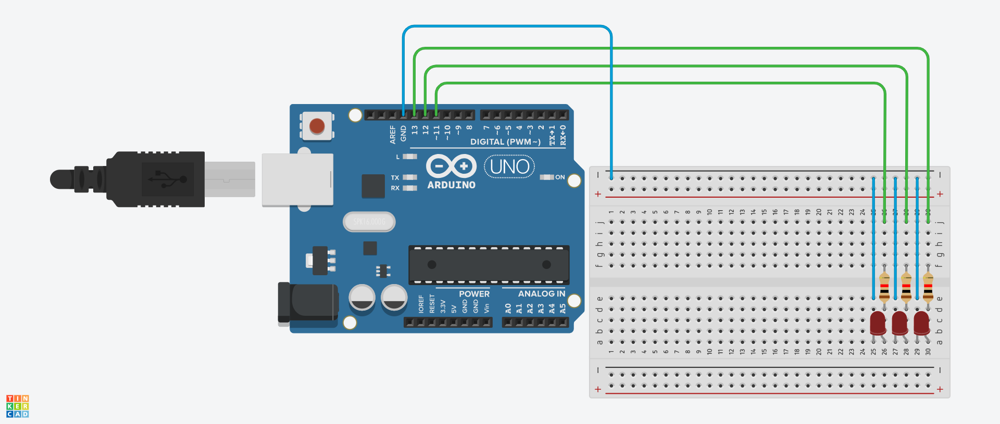

# Blinking LED Arduino
This is a blinking LED activity as the intro for 
Arduino Code programming.

## The Arduino Code
Arduino is both software and hardware. Right there,
you can control your design (hardware) through
the code (software). So, it's one of the reason
also that Arduino is used extensively in prototyping.

There are two built-in functions in Arduino Code:
`void setup` and `void loop`.

`void setup` is where you tell the computer whether
an electronic component being programmed is an
output device. Other initial setup can be
done here, like, the initial mode of an LED
is turned on.

`void loop` is where the execution of commands
happens. Take note, `void loop` is a repeat
forever loop.

Take note of the word `void`. A `void` type 
of function will simply execute all the commands
and will not return any value. Other functions
which are not void can return values.

## The Setup
You need 3 basic LEDs, 1 breadboard and
the Arduino UNO board.

Follow the wiring as indicated in the picture
below:




Then, go to `Code` section and copy the initial
code below:

```
void setup()
{
  pinMode(13, OUTPUT);
  pinMode(12, OUTPUT);
  pinMode(11, OUTPUT);
}

void loop()
{
  digitalWrite(13, HIGH);
  digitalWrite(12, LOW);
  digitalWrite(11, LOW);
  delay(1000);
  
  digitalWrite(13, LOW);
  digitalWrite(12, HIGH);
  digitalWrite(11, LOW);
  delay(1000);
  
  digitalWrite(13, LOW);
  digitalWrite(12, LOW);
  digitalWrite(11, HIGH);
  delay(1000);
}
```

### Code Explanation
There are just 3 commands here:

`pinMode` is the command you tell the Arduino
board what is the mode of a particular pin.
If ever you did not mention that, then the
default is `input`.

`digitalWrite` is the command whether
there will be supply of voltage `HIGH`
or there is none `LOW` for a particular
pin, like in our example,
Arduino Digital Pin 13. For a basic LED,
we all know that when there is sufficient
voltage, it will light up and if there
is too low or none at all, there will be none.

`delay` is the command for temporarily delaying
a program, just like a pause. If prior to 
this, an LED is turned on, it will pause for 
a certain amount of time with the initial 
status of the LED. It's in terms of milliseconds,
because for computers, they work in terms of
milli or nanoseconds. For example, they can 
accomplish 1000 digital tasks in just 1 second.
For high-powered servers, it's more than that.
For advanced programmers, this is very critical:
it can be used for multi-tasking, that 1 second
delay can be used by another mini-program.

## Related Project
You may want additional information about the 
Arduino UNO board, the breadboard and another 
project, so check this out:

<https://github.com/xdvrx1/single-display-arduino-project>
